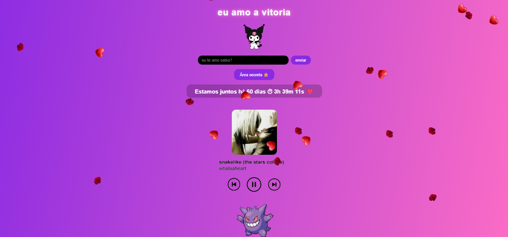
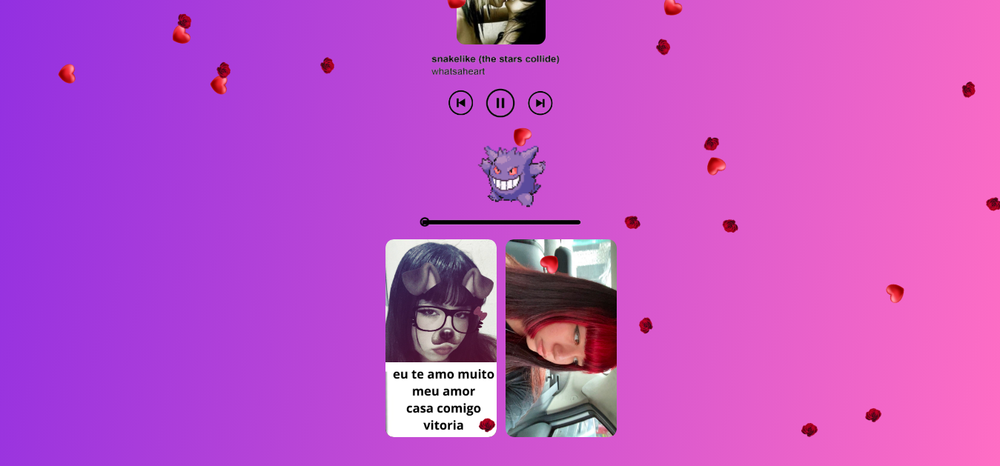

Site fofo para a namorada

Esse projeto é uma aplicação web que fiz para minha atual namorada, foi meu um projeto complicado de codar e levei um mes e meio para acabar e o primeiro de todos.

A ideia foi criar algo bonito, dinamico e fofo para ela.

O que dá pra fazer

Player de musica
Contador do relacionamento
Aba de videos
Upload e player de videos
Input de senha
Input fofo
Informacoes completas entre eu e ela
Animacoes top
Alta beleza
✅

HTML
CSS
JavaScript (puro)
Database

Pré-visualização

Acessar o projeto

https://bryanfellas.github.io/vitoria-meu-amor/

Rodar localmente

git clone  https://bryanfellas.github.io/Scloset/.git
cd landingpage
Depois é só abrir o index.html.
